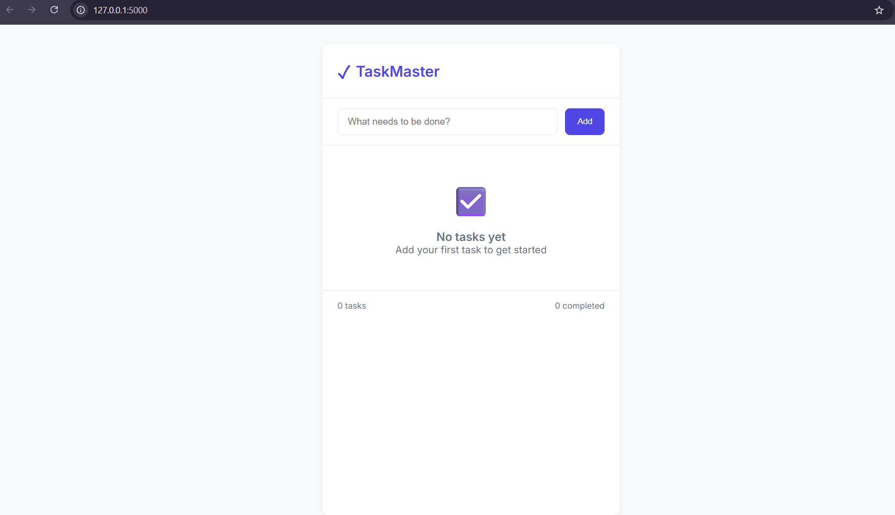

# TaskMaster
A website for To do list 
# 📝 TaskMaster - To-Do List Web App

TaskMaster is a simple yet powerful To-Do List web application built with **Flask (Python)** on the backend and **HTML, CSS, JavaScript** on the frontend. It allows users to create, view, and delete tasks efficiently with a sleek, professional interface.

---

## 🚀 Features

- ✅ Add new tasks with a single click
- 🗑️ Delete tasks effortlessly
- 📋 View your task list in real-time
- 🎨 Responsive and professional UI
- 🔄 Integrated frontend and backend using Flask routes
- ⚡ Lightweight and fast

---

## 🛠️ Technologies Used

- **Frontend**:
  - HTML5
  - CSS3 (Professional styling)
  - JavaScript (DOM manipulation and interactivity)

- **Backend**:
  - Python 3.x
  - Flask micro-framework

---

## 📁 Project Structure
TaskMaster/
│
├── static/
│ └── styles.css # All CSS styles
│
├── templates/
│ └── index.html # Frontend layout
│
├── app.py # Flask app with all routes
└── README.md # Project documentation


---

## 🧑‍💻 Getting Started

### 1. Clone the Repository

```bash
- git clone https://github.com/your-username/TaskMaster.git
- cd TaskMaster
```
### 2. Install Dependencies
Make sure Python is installed on your system, then:

 ```bash
 Copy code
 pip install flask
 ```
 Make sure Python is installed on your system, then:

 ```bash
 pip install flask
```

### 3. Run the Application
bash
```
python app.py
```
Now open your browser and go to:

cpp
Copy code
http://127.0.0.1:5000

### 📸 Screenshots


📌 Future Enhancements
 Add database (e.g., SQLite or MongoDB)

 Add task completion toggle

 Add user authentication (Login/Register)

 Categorize tasks / Add deadlines

 Deploy app to Heroku or Render

🤝 Contributing
Feel free to fork this project, suggest features, or submit pull requests to improve it.

## 📜 License

This project is licensed under the **MIT License** – see the [LICENSE](LICENSE.txt) file for details.


🙌 Acknowledgements
Flask Documentation : https://flask.palletsprojects.com/

MDN Web Docs : https://developer.mozilla.org/

Inspired by minimalist productivity tools

Made with ❤️ by Venkata Sumanth Rayasam
